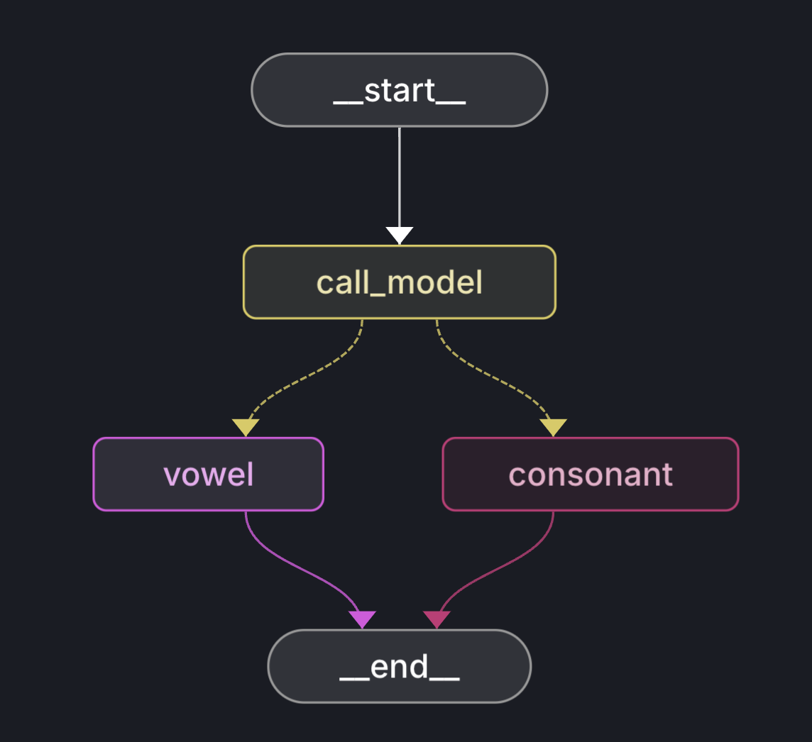

## Collection of agents implemented in LangGraph Python

### Chain
   

### Router
   

### React Agent
   

### Reflection Agent
   

   ### Semantic Long Term Memory
React Agent with Semantic Long Term Memory with LangMem manage memory and search memory tools.
   

### Multi-Agent Network
   

### Multi-Agent Supervisor
   

### Multi-Agent teams
   

### ...
